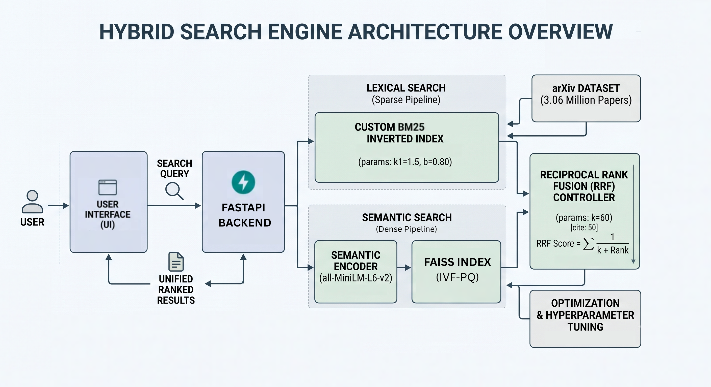

# Arcvester — A Hybrid Search Engine for 3M+ Academic Papers

A high-performance, full-stack Hybrid Search Engine built **from scratch** to index and query **3.06 million** academic papers from the [arXiv Metadata Dataset](https://www.kaggle.com/datasets/Cornell-University/arxiv). This is not a wrapper around Elasticsearch or a managed API — it implements the core mechanics of Information Retrieval theory: custom inverted indexing, binary-packed postings, locality-sensitive hashing, FAISS vector search, and Reciprocal Rank Fusion.


---

## System Architecture

Arcvester runs two independent retrieval pipelines in parallel and fuses their results into a single ranked list.



### Sparse Pipeline — BM25

A custom inverted index purpose-built for **16 GB RAM** constraints:

- **Binary-packed postings** — each posting is **7 bytes** (`uint32` doc ID + `uint8` field ID + `uint16` term count), packed via `struct`, replacing ~80-byte Python tuples
- **Disk-spilling shard management** — monitors RSS at runtime; automatically serializes in-memory shards to disk when memory pressure exceeds a configurable ceiling, then merges shards as raw byte concatenation (not Python object reconstruction)
- **Field-weighted scoring** — BM25 scores computed independently across `title` and `abstract` fields with tunable field weights
- **Atomic persistence** — writes to a temp file and atomically renames on completion; shard files are retained until the final save succeeds (crash-safe)

### Dense Pipeline — Vector Search

**384-dimensional** sentence embeddings generated via `all-MiniLM-L6-v2`:

- **Custom LSH** — random-projection hyperplanes with multi-band hashing for sub-linear approximate nearest-neighbor search
- **Production FAISS (`IndexIVFFlat`)** — Voronoi cell clustering with `nprobe`-tunable recall/latency tradeoff, built for the full 3M+ vector set

### Fusion Layer — Reciprocal Rank Fusion

Keyword scores (unbounded BM25) and spatial distances (bounded cosine similarity) live on incompatible scales. RRF sidesteps normalization entirely:

```
Score(d) = Σ  1 / (k + rank_i(d))      k = 60
```

Each pipeline independently ranks results; RRF converts ordinal rank positions into fused scores, producing a single interleaved ranking that respects both lexical and semantic relevance.

---

## Tech Stack

| Layer | Technologies |
|---|---|
| **Search Engine** | Python, Custom Inverted Index, BM25, LSH |
| **Vector Search** | PyTorch, FAISS, Sentence-Transformers (`all-MiniLM-L6-v2`) |
| **Backend API** | FastAPI |
| **Frontend** | Vanilla JavaScript, Tailwind CSS |

---

## Repository Structure

```
arcvester/
├── core_engine/          # Inverted index, BM25 scorer, FAISS/LSH pipelines, RRF fusion
│   ├── inverted_index.py     # Memory-optimized binary-packed inverted index
│   ├── lexical_searcher.py   # BM25 field-weighted search
│   ├── faiss_index.py        # FAISS IndexIVFFlat builder and searcher
│   ├── lsh_custom_class.py   # Custom LSH with random hyperplanes
│   ├── semantic_searcher.py  # Dense retrieval interface
│   ├── rank_fuser.py         # Reciprocal Rank Fusion
│   └── tokenizer.py          # Tokenizer with stopword removal
│
├── benchmarks/           # Evaluation scripts, synthetic ground-truth datasets, hyperparameter tuning
│   ├── benchmark.ipynb       # Recall/latency benchmarks across pipelines
│   └── multiprocessor.py     # Parallel evaluation harness
│
├── app/                  # Deployment layer
│   ├── backend/              # FastAPI microservice
│   └── frontend/             # Vanilla JS + Tailwind CSS interface
│
└── images/               # Architecture diagrams, demo recordings
```

---

## Getting Started

### Prerequisites

- **Python 3.10+**
- **16 GB RAM** recommended (the engine is optimized for this constraint)

### Installation

```bash
# Clone the repository
git clone https://github.com/meowmeowrahul/arcvester.git
cd arcvester

# Create and activate a virtual environment
python -m venv .venv
source .venv/bin/activate

# Install dependencies
pip install -r requirements.txt
```

### Run the Application

```bash
# Start the FastAPI backend
cd app/backend && uvicorn main:app --reload

# Open the frontend in your browser
open app/frontend/arxiv_search_ui.html
```

---

## License

This project is open-source and available under the [MIT License](./LICENSE).
