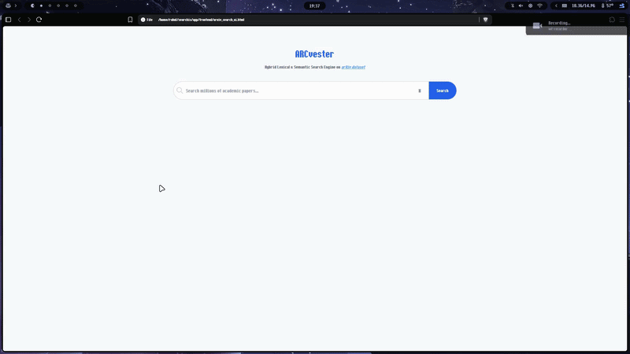

# ARCVESTER- A HYBRID SEARCH ENGINE ON [ARXIV METADATA DATASET](https://www.kaggle.com/datasets/Cornell-University/arxiv) (3M+ Entries)

## SUMMARY
A high-performance, full-stack Hybrid Search Engine built from scratch to index and query over 3.06 million academic papers from the arXiv dataset. Rather than relying on black-box SaaS solutions, this project implements the core mechanics of Information Retrieval (IR) theory.

 

## SYSTEM ARCHITECTURE OVERVIEW 
The System operates by querying a sparse index and a dense vector index.All three structures has its own README.md refer it for detailed metrics.

### [Core Engine](./core_engine)  (./core_engine):
Here lies the main engine of the system.It includes main-memory data(archives),custom BM25 index,the FAISS/LSH pipelines,and Reciprocal Rank Fusion(RFF) function.

### [Benchmarks](./benchmarks) (./benchmarks):
Contains the evaluation scripts and synthetic ground-truth datasets used to tune hyperparameters and prove sub-linear efficiency.

### [App](./app) (./app):
The deployment layer, FastAPI backend microservice and vanilla JavaScript frontend

## TECH STACK 
- Backend & Engine : Python, FastAPI, FAISS, Sentence-Transformers
- Frontend: Vanilla JavaScript, Tailwindcss

