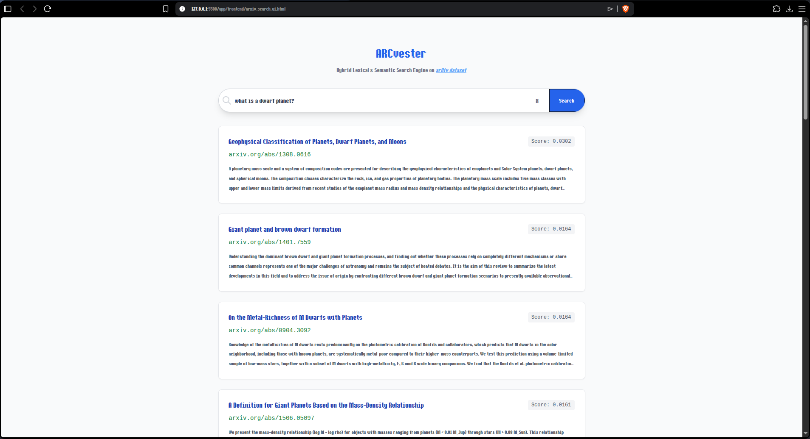

# App — Full-Stack Search Interface

> Decoupled microservice architecture that separates the compute-heavy hybrid retrieval backend from a zero-dependency browser frontend.



---

## Architecture

```
User → Frontend (Vanilla JS) → FastAPI Backend → [FAISS + BM25 → RRF] → JSON Response → Rendered Cards
```

The app is split into two independent layers:

| Layer                      | Stack                          | Role                                                            |
| -------------------------- | ------------------------------ | --------------------------------------------------------------- |
| **Backend** (`/backend`)   | FastAPI, Uvicorn               | Loads indexes into memory, executes hybrid search, returns JSON |
| **Frontend** (`/frontend`) | Vanilla JS, Tailwind CSS (CDN) | Renders a Google-style search UI, consumes the REST API         |

This separation means the backend can be deployed, scaled, and load-tested independently of the UI — and the frontend requires **zero build tooling**.

---

## Backend (`/backend`)

**Single file:** [`main.py`](./backend/main.py) — clean, minimal, production-ready.

### Startup Sequence

On server boot, the following are loaded **once** into memory:

- **FAISS index** — precomputed dense vector index for semantic similarity
- **BM25 inverted index** — serialized lexical search structure
- **3.06M document metadata** — titles, abstracts, and arXiv IDs from the full dataset

### Request Pipeline

Every `GET /search?query=...` triggers the full RRF hybrid pipeline:

1. **Semantic search** — FAISS nearest-neighbor lookup on the query embedding
2. **Lexical search** — BM25 term-frequency scoring against the inverted index
3. **Reciprocal Rank Fusion** — merges both ranked lists into a single relevance-ordered result set
4. **JSON response** — returns top-k results with `doc_id`, `title`, `abstract`, and `score`

### Key Engineering Decisions

- **CORS middleware** enabled for cross-origin requests — allows the frontend to call the API from `file://` or any origin during development
- **Async endpoint** (`async def`) — non-blocking request handling via Uvicorn's event loop
- **No ORM, no database** — all data is loaded from pre-built artifacts (`.pkl`, `.json`, FAISS index), keeping the server stateless and fast

### Response Format

```json
{
  "query": "quantum entanglement",
  "results": [
    {
      "doc_id": "2103.15348",
      "title": "Quantum Entanglement in Many-Body Systems",
      "abstract": "We study the structure of entanglement...",
      "score": 0.0652
    }
  ]
}
```

---

## Frontend (`/frontend`)

**Two files total:** [`arxiv_search_ui.html`](./frontend/arxiv_search_ui.html) + [`index.js`](./frontend/index.js)

### Design Principles

- **Zero build tooling** — no Webpack, no Vite, no Node.js, no `npm install`
- **Vanilla JavaScript** — async/await `fetch` calls, DOM manipulation, no framework overhead
- **Tailwind CSS via CDN** — utility-first styling with no local CSS compilation
- **Google-style search UI** — centered search bar, clean result cards, minimal chrome

### Features

- **Real-time result rendering** — each search dynamically injects result cards into the DOM
- **Direct arXiv links** — every result card links to `arxiv.org/abs/{doc_id}` for one-click paper access
- **Loading states** — animated "Querying 3 Million+ Documents…" indicator during fetch
- **Error handling** — graceful fallback message when the backend is unreachable
- **Responsive layout** — max-width container with mobile-friendly padding
- **Keyboard support** — Enter key triggers search without clicking the button

---

## How to Run

### 1. Start the Backend

```bash
cd app/backend && uvicorn main:app --reload
```

The API will be available at `http://127.0.0.1:8000`. Confirm with:

```bash
curl "http://127.0.0.1:8000/search?query=neural+networks"
```

### 2. Open the Frontend

Open `app/frontend/arxiv_search_ui.html` directly in any modern browser. No server required — it fetches from `http://127.0.0.1:8000` by default.

---

## Project Structure

```
app/
├── backend/
│   └── main.py                  # FastAPI server — loads indexes, runs RRF pipeline
├── frontend/
│   ├── arxiv_search_ui.html     # SPA entry point — Tailwind-styled search UI
│   └── index.js                 # API client — fetch, render, error handling
└── README.md
```
