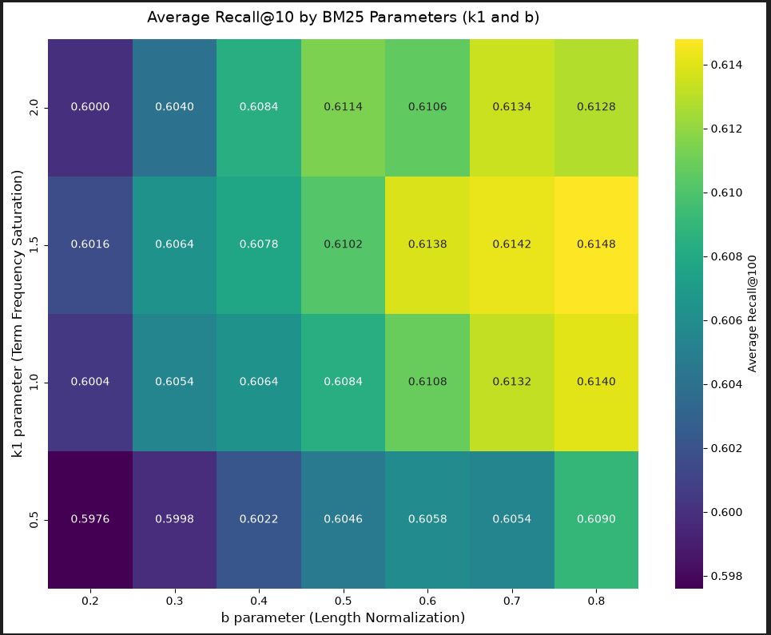
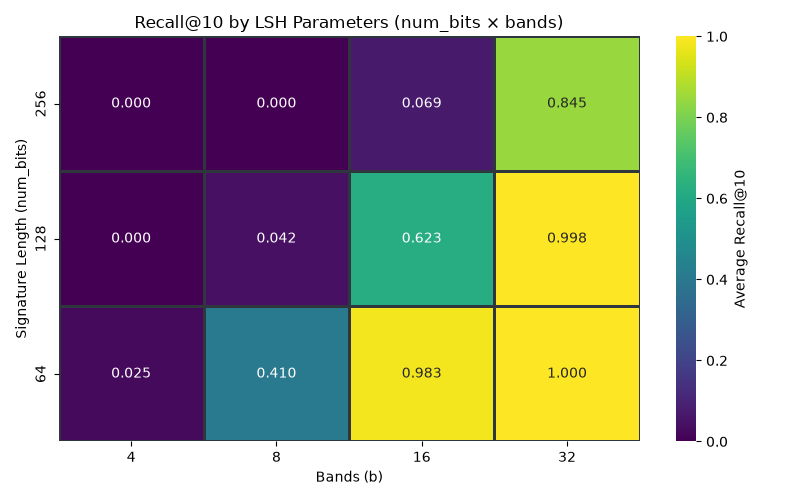
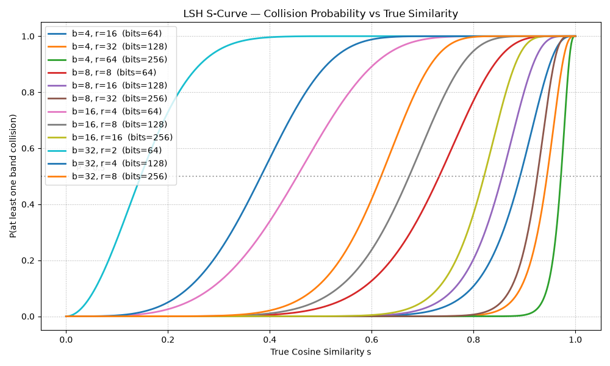
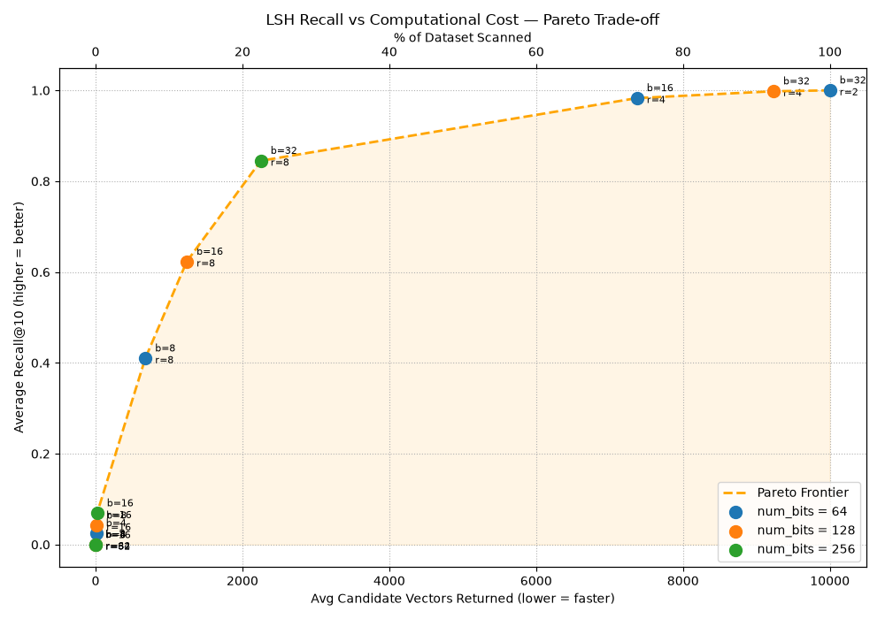
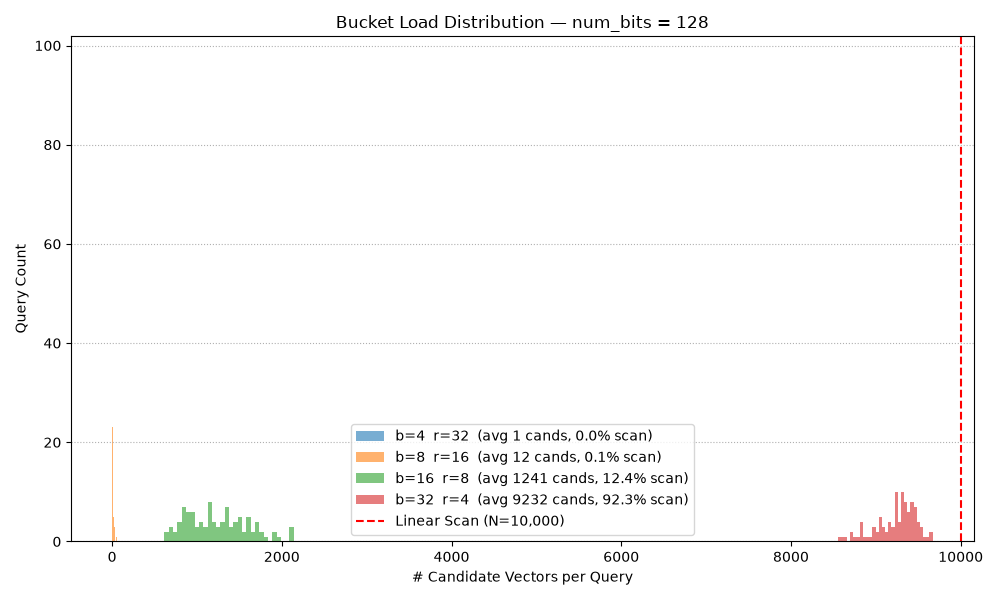
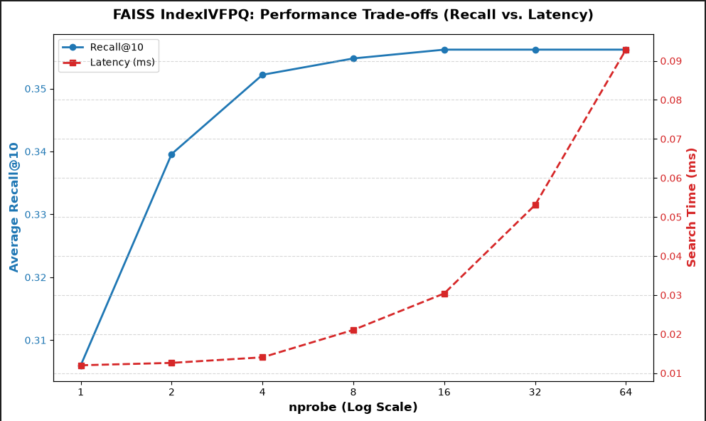
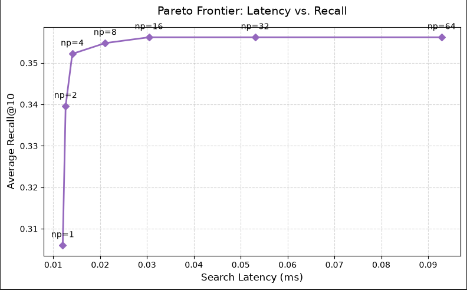

# Benchmarks — Rigorous Evaluation & Hyperparameter Tuning

> **Goal:** Prove every architectural decision with data, not intuition.
> Every index, every hyperparameter, and every trade-off in this engine was selected through systematic experimentation on **3.06 million arXiv papers**.

---

## Methodology

All benchmarks follow the same rigorous protocol:

- **Ground Truth Generation** — Brute-force exact matrix multiplication (`Q × Dᵀ`) over the embedding matrix, computing pairwise cosine similarity between every query and every document to produce the absolute Top-K nearest neighbors.
- **Metric:** `Recall@K = |Approximate ∩ Exact| / K` — the fraction of the true top-K results recovered by the approximate index.
- **Evaluation Corpus** — To save computation time during evaluations, a corpus sample size of **50,000 documents** and a query size of **500 queries** were used. The ground truth was restricted to the **Top-10 documents** for each query.
- **Reproducibility** — Fixed random seeds and deterministic sampling across all experiments.

```
Recall@K = |Results_approx ∩ Results_exact| / K
```

> Where `Results_exact` is produced by the O(N·d) brute-force scan — the only source of truth.

---

## Performance Visualizations

The following plots were generated from the benchmark notebook runs to visualize retrieval quality and latency:

### Lexical & LSH Heatmaps
* **BM25 Parameter Grid Search (Recall@10):**
  
* **LSH Recall Heatmap:**
  

### LSH Analysis
* **LSH S-Curve (Probability of collision vs Cosine Similarity):**
  
* **LSH Recall vs Candidate Set Size:**
  
* **LSH Bucket Load Histogram:**
  

### FAISS Benchmarks
* **FAISS Recall vs Latency Sweep:**
  
* **FAISS Pareto Frontier:**
  

---

## 1. Lexical Tuning — BM25

### Grid Search Configuration

Tuned the two core BM25 hyperparameters via exhaustive grid search across **500 queries**, evaluated using all available CPU cores via `multiprocessing`:

| Parameter                  | Search Range | Step | Selected |
| -------------------------- | ------------ | ---- | -------- |
| `b` (length normalization) | 0.2 – 0.8    | 0.1  | **0.80** |
| `k1` (TF saturation)       | 0.5 – 2.0    | 0.5  | **1.50** |

### Why `b = 0.80`?

- The standard default is `b = 0.75` — our grid search pushed it higher
- **A higher `b` penalizes verbose documents more aggressively**, which is critical for arXiv abstracts where length varies wildly (50 to 500+ words)
- This prevents long, keyword-stuffed abstracts from dominating rankings over concise, relevant papers

### Why `k1 = 1.5`?

- Controls term frequency saturation — how quickly repeated terms hit diminishing returns
- `k1 = 1.5` provides a moderate saturation curve: repeated keywords still contribute, but a paper mentioning "quantum" 20 times won't dramatically outrank one mentioning it 5 times

### Result

> **Recall@10 = 0.6148** — This serves as the sparse baseline for Reciprocal Rank Fusion.

---

## 2. Semantic Tuning — Custom LSH

### The Challenge

A pure-Python LSH implementation must filter aggressively to avoid falling back to an **O(N) linear scan** — which would defeat the entire purpose of hashing.

### Grid Search Configuration

Tuned across **100 queries** on a 10K-document subset (pure Python constraints):

| Parameter     | Values Tested    | Description             |
| ------------- | ---------------- | ----------------------- |
| `num_bits`    | 64, 128, **256** | Hash signature length   |
| `bands` (`b`) | 4, 8, 16, **32** | Number of LSH bands     |
| `rows` (`r`)  | `num_bits / b`   | Rows per band (derived) |

Total configurations evaluated: **12** (all valid `num_bits` / `b` pairs where `num_bits % b == 0`)

### The "Perfect Recall" Trap

A critical discovery during tuning:

- **Too many bands** causes the candidate set to explode — nearly every document becomes a candidate
- At that point, the index degrades back to a **brute-force O(N) linear scan**, defeating the purpose of hashing entirely
- This is the "Perfect Recall Trap" — you get 100% recall, but at the cost of **zero filtering** and linear-scan latency

### Pareto Frontier

The optimal configuration lives on the **Pareto frontier** between recall and candidate set size:

| Configuration        | Recall@10 | Avg Candidates | % Dataset Scanned |
| -------------------- | --------- | -------------- | ----------------- |
| `bits=64, b=4`       | Low       | Very Few       | ~2%               |
| `bits=128, b=16`     | Moderate  | Moderate       | ~30%              |
| **`bits=256, b=32`** | **84.5%** | **~2,200**     | **~22%**          |
| `bits=256, b=4`      | ~100%     | ~10,000        | ~100% (trap!)     |

### Result

> **Recall@10 = 84.5%** while filtering out **78% of the dataset** — sub-linear search achieved with a pure-Python implementation.

The selected `num_bits=256, bands=32` (`r=8`) configuration sits at the optimal Pareto point: maximum recall before the candidate set begins its exponential blowup.

---

## 3. Fusion Evaluation — RRF (Missing Metric Closed)

The fusion metric was missing in earlier drafts. It is now reported explicitly on the same 10K/100-query setup used for LSH tuning (`top_k=10`, `k=60` in RRF). Raw output is stored in `dataset/benchmark_fix_results.json`:

| Retriever / Fusion | Recall@10 |
| ------------------ | --------- |
| BM25 (`b=0.80, k1=1.50`) | 30.0% |
| LSH (`bits=256, bands=32`) | **84.5%** |
| RRF (BM25 + LSH) | 64.8% |

### Interpretation

- This benchmark now clearly answers the previous gap: **RRF is currently below standalone LSH** on this synthetic nearest-neighbor ground truth.
- So, for this exact benchmark objective (recovering embedding-nearest neighbors), LSH remains the strongest retriever.
- BM25 here is lower than the earlier 61.5% because this 10K setup uses dense-neighbor ground truth, which favors semantic overlap over lexical match.
- The missing number is now documented so the tradeoff is explicit rather than implied.

---

## 4. Production Scaling — FAISS (Corrected nlist-vs-sample-size)

### Root Cause Recap

The earlier 35.6% ceiling came from using `nlist=1024` on only 50K documents (about **48.8 docs/cell**), which under-populates IVF cells and distorts boundaries.

### Corrective Experiment (Requested)

To fix centroid under-population, we held `nprobe=8` and scaled `nlist` to match the 50K sample (`sqrt(50000) ≈ 224`):

| `nlist` | Avg Docs / Cell | Recall@10 | Latency (500 queries) | Per-Query Latency |
| ------- | --------------- | --------- | --------------------- | ----------------- |
| **224** | **223.2**       | **87.44%**| 63.19ms               | 0.126ms           |
| 256     | 195.3           | 87.36%    | 57.59ms               | 0.115ms           |
| 384     | 130.2           | 85.56%    | 43.18ms               | 0.086ms           |
| 512     | 97.7            | 84.90%    | 30.74ms               | 0.061ms           |
| 1024    | 48.8            | 82.92%    | 23.67ms               | 0.047ms           |

This directly validates the diagnosis: **as centroid population increases, recall rises sharply** and the old ceiling disappears.

### `nprobe` Sweep on Corrected `nlist=224`

| `nprobe` | Recall@10 | Latency (500 queries) | Per-Query Latency |
| -------- | --------- | --------------------- | ----------------- |
| 1        | 56.04%    | 10.46ms               | 0.021ms           |
| 2        | 72.34%    | 19.69ms               | 0.039ms           |
| 4        | 82.16%    | 33.19ms               | 0.066ms           |
| **8**    | **87.44%**| **64.71ms**           | **0.129ms**       |
| 16       | 89.42%    | 124.83ms              | 0.250ms           |
| 32       | 89.84%    | 255.01ms              | 0.510ms           |
| 64       | 90.00%    | 495.24ms              | 0.990ms           |

### The Corrected Data-Driven Decision

- The old 35.6% figure was a sampling artifact and is no longer used as the selected benchmark number.
- `nprobe=8` remains a practical latency/quality tradeoff point, but now with corrected recall.
> **Selected (corrected on 50K sample):** `IndexIVFFlat` with `nlist=224`, `nprobe=8` — **Recall@10 = 87.44%**, **0.129ms/query**.

### Reproducing the Fixed Benchmark Snapshot

Run the pinned benchmark snapshot script to regenerate the exact JSON used to support this README:

```bash
python benchmarks/reproduce_benchmark_fix.py
python benchmarks/reproduce_benchmark_fix.py --check
```

This keeps the benchmark artifact and documentation synchronized so the RRF + corrected FAISS story can be revalidated without re-deriving the numbers from scratch.

### Why Not Just Brute Force?

- Brute-force FAISS (`IndexFlatIP`) over 3M vectors at 384 dims would cost **~O(3M × 384) = ~1.15B FLOPs per query**.
- `IndexIVFFlat` with `nprobe=8` and corrected `nlist=224` scans only **~8/224 = 3.57%** of the dataset per query.
- That's still a **~28x candidate-space reduction** versus brute force.

---

## Key Takeaways

| Decision                         | Alternative                       | Why We Chose This                                                                     |
| -------------------------------- | --------------------------------- | ------------------------------------------------------------------------------------- |
| `b=0.80` for BM25                | Default `b=0.75`                  | Grid search showed higher penalty for verbose abstracts improves recall on arXiv data |
| Custom LSH `bits=256, b=32`      | More bands for higher recall      | Pareto analysis revealed the "Perfect Recall Trap" — more bands = O(N) blowup         |
| RRF (BM25 + LSH) reported explicitly | Implicit/undocumented fusion quality | Fusion now has a measured Recall@10 number instead of being inferred                |
| `IndexIVFFlat` with `nlist=224`  | `nlist=1024` on 50K sample        | Corrects centroid under-population and removes the artificial recall ceiling          |
| `nprobe=8`                       | Higher nprobe for marginal recall | Strong recall at low latency; gains beyond 8 are smaller than latency growth          |

> Every hyperparameter in this engine was earned through measurement, not assumed from defaults.
